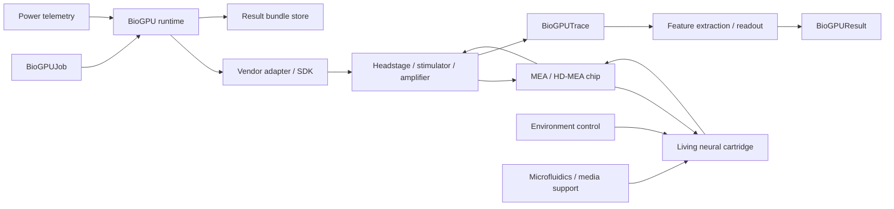

# BioGPU-A1 Hardware Blueprint

Version: `v2.2`

## Goal

Turn BioGPU-A1 from software/wetware concept into a modular hardware system map ready for replay, dry-run and future live MEA/HD-MEA implementation.

## Boundary

This blueprint is an engineering system design. It is not a wet-lab protocol, not a vendor pinout manual, and not a live stimulation safety document. Live implementation requires selected platform documentation, qualified lab SOPs and trained personnel.

## System signal chain

## Hardware components

### wet_cartridge — Replaceable living neural cartridge

- Layer: `wetware`
- Stage: `licensed_lab`
- Criticality: `required`
- Role: Physical living substrate chamber containing neuronal culture over MEA/HD-MEA.
- Target spec: Transparent sealed/controlled cartridge; first target 2D neuronal network over electrode array; final geometry depends on selected MEA vendor.
- Bridge options: 60/120/256 electrode MEA cartridge/dish class, single-well MEA cartridge
- Target options: 4096+ channel HD-MEA single-well cartridge, future 3D organoid/neurosphere cartridge
- Notes:
  - Not a standalone biological protocol; live use requires SOP, sterility plan, and facility controls.
  - Must expose stable electrical contact to the acquisition/stimulation electronics through vendor-approved docking.

### mea_chip — MEA/HD-MEA electrode chip

- Layer: `bioelectronic_interface`
- Stage: `licensed_lab`
- Criticality: `required`
- Role: Bidirectional interface: stimulate selected sites and record extracellular activity.
- Target spec: Bridge: 59-256 electrode MEA. Target: 1024-4096+ addressable HD-MEA channels. Planning pitch class 20-200 µm.
- Bridge options: MCS MEA2100-compatible 60/120/256 electrode MEA, Axion Maestro-compatible MEA plate
- Target options: 3Brain CorePlate/BioCAM-class 4096 electrode HD-MEA, future higher-density HD-MEA
- Notes:
  - Exact electrode count, pitch, contact material and well geometry are vendor-specific.
  - All stimulation and safety limits are delegated to vendor manuals and approved lab SOP.

### headstage_stimulator — Headstage, amplifier and stimulator

- Layer: `electronics`
- Stage: `licensed_lab`
- Criticality: `required`
- Role: Low-noise acquisition, ADC, stimulation command execution, timestamping.
- Target spec: Bidirectional acquisition/stimulation system with API/SDK access, timestamping, and export of raw traces/spikes.
- Bridge options: MCS MEA2100 headstage/stimulator, Axion Maestro-class acquisition/stimulation backend
- Target options: 3Brain BioCAM/BioCAM DupleX-class HD-MEA backend, Intan RHS-class research controller where appropriate
- Notes:
  - BioGPU runtime must talk to this through an adapter, not through hard-coded pinouts.
  - Dry-run mode must validate patterns before any live output is allowed.

### environment_control — Environmental control module

- Layer: `life_support`
- Stage: `licensed_lab`
- Criticality: `required`
- Role: Maintain stable conditions around the living substrate.
- Target spec: Temperature, CO2, humidity, vibration/noise isolation, and sensor telemetry suited to selected wetware platform.
- Bridge options: built-in MEA stage-top temperature control, integrated incubated multiwell MEA chamber
- Target options: closed cartridge environment with telemetry export, long-run incubated HD-MEA setup
- Notes:
  - This is part of the BioGPU system energy budget.
  - Exact values are SOP-dependent and intentionally not specified here as an operational protocol.

### microfluidics — Microfluidics / media maintenance module

- Layer: `life_support`
- Stage: `future`
- Criticality: `recommended`
- Role: Support long-running wetware operation through medium handling and monitoring.
- Target spec: Perfusion/media exchange capability or vendor-supported maintenance mode, with logging and alarms.
- Bridge options: manual/vender-SOP maintenance for short bridge runs
- Target options: closed-loop microfluidic cartridge, remote-access wetware platform model
- Notes:
  - Optional for short software dry-runs; important for live long-duration BioGPU experiments.
  - Must be handled by qualified lab procedures, not by this repository.

### host_pc — BioGPU controller workstation

- Layer: `compute`
- Stage: `now`
- Criticality: `required`
- Role: Runs BioGPU runtime, adapters, feature extraction, readout, benchmark orchestration and logging.
- Target spec: Minimum: 8 cores, 32 GB RAM, 1 TB SSD for full local runs. Better: 16+ cores, 64 GB RAM, 2+ TB SSD.
- Bridge options: Ubuntu workstation, lab PC attached to vendor acquisition system
- Target options: dedicated acquisition PC + analysis workstation pair, server with NAS for long recordings
- Notes:
  - GPU is optional for current Zenodo/replay benchmarks; CPU and fast storage matter more now.
  - Live closed-loop latency depends on vendor SDK path, OS scheduling and network isolation.

### storage — Data storage and result bundle store

- Layer: `compute`
- Stage: `now`
- Criticality: `required`
- Role: Stores raw traces, spikes, BioGPUTrace, BioGPUResult, logs, reports and audit manifests.
- Target spec: SSD/NVMe for active runs; external or NAS backup for raw traces and long experiments.
- Bridge options: local SSD for replay datasets, USB/NAS backup
- Target options: RAID/NAS storage with immutable run bundles
- Notes:
  - Result bundles must include run manifest, version, hardware config, adapter mode and data hashes.

### runtime — BioGPU runtime software

- Layer: `software`
- Stage: `now`
- Criticality: `required`
- Role: Defines BioGPUJob → substrate adapter → BioGPUTrace → readout → BioGPUResult.
- Target spec: Same job contract must run in replay, dry-run and live modes.
- Bridge options: RealDataReplayBioGPUSubstrate, dry-run vendor adapter
- Target options: LiveMEA adapter with vendor backends
- Notes:
  - This is the part we can fully develop in this environment.
  - The runtime must never assume a single vendor or electrode geometry.

### visual_monitoring — Optional microscope / camera monitoring

- Layer: `monitoring`
- Stage: `future`
- Criticality: `optional`
- Role: Provides visual QC of cartridge condition and experiment state.
- Target spec: Optional microscope/camera stream linked to run logs.
- Bridge options: manual microscope QC
- Target options: integrated imaging with timestamps
- Notes:
  - Useful for troubleshooting and publication evidence; not required for replay benchmarks.

### power_ups — Power, UPS and telemetry

- Layer: `infrastructure`
- Stage: `power_pc`
- Criticality: `recommended`
- Role: Stabilizes long-running experiments and tracks power for energy-per-task calculations.
- Target spec: UPS, watt meter, per-device power logging where possible.
- Bridge options: external watt meter for host + electronics
- Target options: per-module telemetry feed into BioGPU metrics
- Notes:
  - Energy-per-task claims require measured power, not estimated power only.

### sop_safety — Lab SOP, ethics and biosafety boundary

- Layer: `governance`
- Stage: `licensed_lab`
- Criticality: `required`
- Role: Defines what can be done live, by whom, and with which vendor/lab-approved procedures.
- Target spec: Approved SOPs, vendor manuals, trained personnel, facility approval as applicable.
- Bridge options: no live culture work in software-only environment
- Target options: qualified lab deployment package
- Notes:
  - The repository stores engineering contracts and checklists, not executable live-culture recipes.
  - All live stimulation settings must be validated in a lab-specific safety gate.

## Connection table

| # | Source | Target | Signal | Interface | Purpose | Stage |
|---:|---|---|---|---|---|---|
| 1 | `runtime` | `host_pc` | software process | local OS / Python | Start BioGPU job, load manifest, select replay/dry/live backend. | now |
| 2 | `runtime` | `headstage_stimulator` | validated command | vendor SDK/API adapter | Send validated stimulation/acquisition request to vendor backend. | licensed_lab |
| 3 | `headstage_stimulator` | `mea_chip` | electrical I/O | vendor-approved connector/dock | Drive stimulation and receive electrode signals. | licensed_lab |
| 4 | `mea_chip` | `wet_cartridge` | extracellular interface | culture-on-chip contact field | Couple the living network to the electrode array. | licensed_lab |
| 5 | `wet_cartridge` | `mea_chip` | biological spike response | extracellular readout | Return neural response to electrode field. | licensed_lab |
| 6 | `mea_chip` | `headstage_stimulator` | analog/digitized acquisition | vendor acquisition path | Amplify, digitize, timestamp and stream/store recordings. | licensed_lab |
| 7 | `headstage_stimulator` | `runtime` | recording stream/files | vendor SDK/export files | Create BioGPUTrace inputs for feature extraction. | now |
| 8 | `runtime` | `storage` | run bundle | filesystem | Persist BioGPUJob, BioGPUTrace, BioGPUResult, hardware manifest and logs. | now |
| 9 | `environment_control` | `wet_cartridge` | environmental support | stage/incubator/cartridge control | Keep substrate in vendor/lab-approved operating envelope. | licensed_lab |
| 10 | `microfluidics` | `wet_cartridge` | media/perfusion support | lab/vender-approved fluidic path | Support longer wetware experiments. | future |
| 11 | `visual_monitoring` | `storage` | image/video metadata | timestamped files | Attach visual QC evidence to result bundle. | future |
| 12 | `power_ups` | `runtime` | power telemetry | meter/API/manual log | Feed measured power into energy-per-task estimates. | power_pc |

## Engineering formulas

- `N_samples = N_channels * f_s * T_window` — Number of sampled values per acquisition window. Used for: RAM and storage planning.
- `B_window = N_channels * f_s * T_window * bytes_per_sample` — Bytes generated for one raw trace window. Used for: per-task storage estimate.
- `R_Bps = N_channels * f_s * bytes_per_sample` — Raw stream bandwidth in bytes per second. Used for: DAQ/storage planning.
- `S_day_GB = R_Bps * 86400 / 1e9` — Approximate continuous raw storage per day. Used for: long-run experiment planning.
- `T_loop = T_encode + T_stim + T_bio + T_acq + T_decode` — Closed-loop runtime latency. Used for: control-loop feasibility.
- `E_task = (P_host + P_electronics + P_environment) * T_run / N_tasks` — Energy per completed task, requiring measured power for real claims. Used for: GPU/CPU/BioGPU comparison.
- `D_ch = N_channels / A_active` — Electrode/channel density over active area. Used for: MEA vs HD-MEA comparison.

## Implementation stages

### software_now
- Keep replay substrate and BioGPU runtime vendor-neutral.
- Generate hardware manifests and result bundles without live hardware.
- Run Zenodo/replay benchmarks and power-PC scripts.
### power_pc
- Run 100-1000 shuffle and multi-seed sweeps.
- Add measured host power for replay compute energy estimates.
- Prepare NAS/backup and reproducible result bundle storage.
### licensed_lab_bridge
- Select one bridge platform: MCS/Axion-class MEA or equivalent.
- Map vendor SDK into LiveMEA adapter without changing BioGPUJob contract.
- Validate dry-run pattern logs before any live command.
### hd_mea_target
- Move to 1024-4096+ channel HD-MEA platform.
- Measure latency, stability, repeatability and energy.
- Compare live BioGPU tasks against CPU/GPU/neuromorphic baselines.

## Real platform reference classes

The blueprint intentionally stays vendor-neutral, but the first practical hardware search space is:

- Bridge MEA: MCS MEA2100-class systems or Axion Maestro-class multiwell systems.
- Target HD-MEA: 3Brain CorePlate/BioCAM-class 4096-channel systems.
- Remote wetware reference: FinalSpark-style remote MEA/organoid platform as a conceptual external benchmark.

These are references for architecture and procurement discussions, not hard dependencies.
