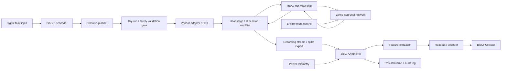

# BioGPU-A1 Signal Chain



## Timing model

```text
T_loop = T_encode + T_stim + T_bio + T_acq + T_decode
```

For replay mode, `T_stim` and `T_bio` are dataset replay delays.  
For live mode, these must be measured on the selected vendor/lab setup.

## Storage model

```text
N_samples = N_channels * f_s * T_window
B_window = N_channels * f_s * T_window * bytes_per_sample
R_Bps = N_channels * f_s * bytes_per_sample
S_day_GB = R_Bps * 86400 / 1e9
```

## Energy model

```text
E_task = (P_host + P_electronics + P_environment) * T_run / N_tasks
```

Publication-grade energy claims require measured power, not assumptions.
